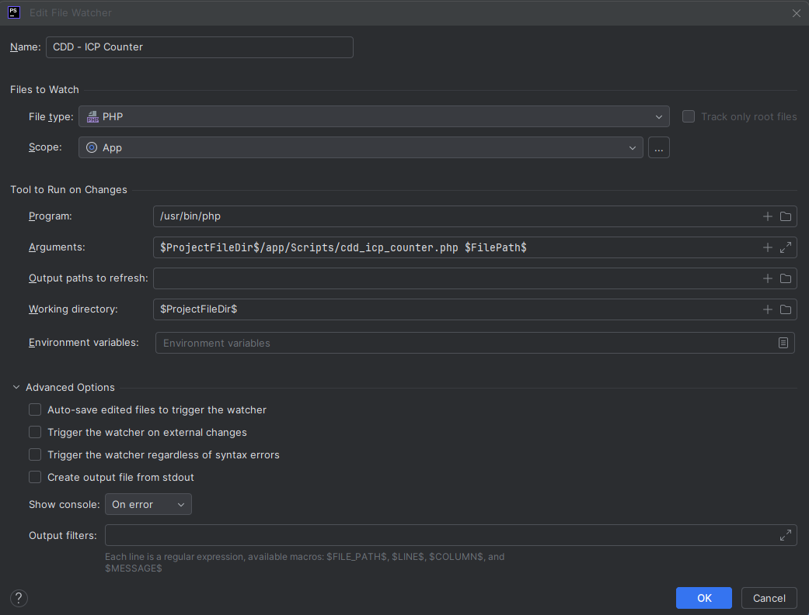

# Desafio 1 - [Jornada Dev+Eficiente](https://deveficiente.com/)

## Cognitive-Driven Development (CDD)

A lightweight design discipline that keeps each “code unit” (e.g. a class) small and easy to understand by placing a hard limit on its **Intrinsic Complexity Points (ICPs)**.

## Core Rules

1. ### **Define which language constructs count as ICPs**   
    - **Branches** (e.g. `if`/`else`, `switch`/`case`, loops, ternary) — **1 pt** each
    - **Conditions** (each boolean sub-expression, e.g. `a > b && c < d`) — **1 pt** each
    - **Exception handling** (`try`/`catch`/`finally`) — **1 pt** each
    - **Internal coupling** (use of another project class) — **1 pt** each
    - **External coupling** (use of JDK or third-party class) — **0.5 pt** each

2. ### **Enforce a strict per-class limit**
    - No class may exceed **10 ICP** in total.
    - As soon as a class reaches ►10 ICP, it must be refactored (e.g. split responsibilities, extract methods or collaborators).

3. ### **Annotate for visibility**
   ```php
   @ICP(8)
   public class FooController {
     @ICP(1) private BarService service;
     @ICP(1) private BazRepository repo;
     @ICP(2) public void execute(...) { … }
     // …
   }

4. ### **File Watcher**
     - There is a [ICP Counter](app/Scripts/cdd_icp_counter.php) to count the ICPs in a class and show it on the top of the class.
     - Should add a file watcher to run the script on every file saved (on PHPStorm). 
     
     - **Next steps**: Convert the script into a PHPStan rule that analyzes constraints on the fly, eliminating the need to manually mark ICP points.
    
